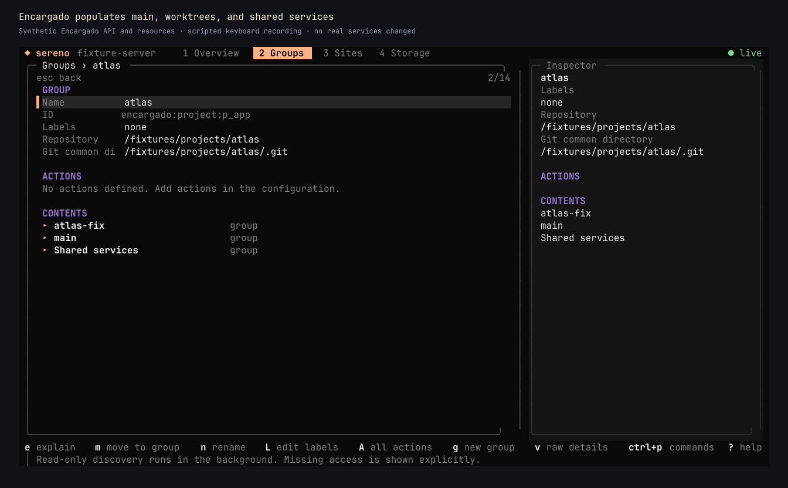

# Resource tree demo

[Watch the 79-second recording](resource-tree-demo.mp4).

The video captures the actual OpenTUI renderer driven by scripted keyboard input. It uses synthetic inventory, a local mock of Encargado's Unix-socket API, mocked custom commands, and a disposable configuration file. It does not operate real services.

The walkthrough shows imported project and worktree groups, a shared database with two consumers, a stopped service's Start preview and refreshed state, saved labels, a custom resource's Start command, creating a nested group, moving a resource into it, the Sites view, and the command palette.

